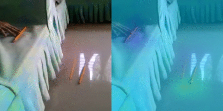

# something-something-v2-baseline
Contains code and pretrained models to get you started with a baseline on version 2 of "something-something" dataset

- Paper: https://arxiv.org/abs/1706.04261
- Data and Leaderboard: https://20bn.com/datasets/something-something/v2

Performance of pre-trained model on **validation set**:

|Model|top-1|top-5|
|-------|:------:|:------:|
|model3D_1|49.88%|78.82%|
|model3D_1_224|47.67%|77.35%|
|model3D_1 with left-right augmentation and fps jitter|51.33%|80.46%|

## Prerequisites
- [Conda](https://conda.io/docs/user-guide/install/index.html#) - manages Python environment and dependencies
- Run `conda update conda` to ensure the package is up-to-date

## Setting up

#### Installation
- Clone the project and move into the root directory
- Setup python environment - `conda env update`
   - This will setup an environment named - `smth`
- Activate python environment - `source activate smth`

#### Download the dataset
The dataset is provided in the form of videos in `webm` format using VP9 
encoding, occupying a total size of 19.4 GB. The videos are in landscape format
with height (the shorter side) of 240px at 12 frames/sec.

- Follow instructions on the data page
- Download the json files to fetch annotations of the data

#### Modify config file to include the above paths
In any configuration file (e.g. `configs/config_example.json`), modify the
- path to data: `data_folder`
- path to JSONs: `json_data_train`, `json_data_val`, `json_data_test`

#### How to train from scratch?
Run: `CUDA_VISIBLE_DEVICES=0,1 python train.py -c configs/config_example.json -g 0,1 --use_cuda`

where,
- `CUDA_VISIBLE_DEVICES`: environment variable to specify GPU ids to use.
(_Note: uses all gpus if not specified_)

### Hyperparameters
Please refer to config file at: `configs/config_example.json`
- `batch_size: 30` - change this to fill your GPU memory (_Note: should be a 
multiple of number of gpus used_)
- `num_workers: 5`: number of parallel processes to fetch and pre-process data
 (increase to max possible CPU cores you have to get better GPU utilisation)
- `lr: 0.008` - increase it if you happen to increase the batch size
- `clip_size: 72` - number of frames in a video sample as input to the model 
(which at default 12 fps covers 6 secs)
- `step_size_train: 1` - factor by which FPS is reduced 
 (so a step size of 2 would mean an fps of 6)
- `input_spatial_size: 84` - dimension of each frame in input is scaled
 and cropped to 84x84, but you can use the ubiquitous frame size of 224x224, 
 since the data is provided with height of 240px in landscape format
- `column_units: 512`: desired number of units in feature space for each sample

## How to use a pre-trained model?
- Pre-trained models available in directory: `trained_models/pretrained/`
With their respective config files here: `configs/pretrained/`

- We provide a vanilla implementation of VGG-styled 3D-CNN with 11 layers of 
3D convolutions. Please refer here: 
[model3D_1.py](https://github.com/TwentyBN/smth-smth-baseline/blob/master/models/model3D_1.py)

- Use the [notebook](https://github.com/TwentyBN/smth-smth-baseline/blob/master/notebooks/get_prediction_from_pre_trained_model.ipynb)
 to get predictions from these models

## Test model and get submission file on test data
Modify path to model file in `checkpoint` variable of config file

`CUDA_VISIBLE_DEVICES=0,1 python train.py -c configs/pretrained/config_model1.json -g 0,1 -r -e --use_cuda`

The options used here are:
- `-r`: to resume an already trained model
- `-e`: to evaluate the model on test data

## Grad-CAM
Use the [notebook](https://github.com/TwentyBN/smth-smth-baseline/blob/master/notebooks/get_saliency_maps_CAM.ipynb)
 to visualize saliency maps of any example from validation set

e.g.



```
Id of the video sample = 56620
True label --> 12 (Dropping something onto something)

Top-5 Predictions:
Top 1 :== Dropping something next to something. Prob := 41.51%
Top 2 :== Throwing something. Prob := 13.26%
Top 3 :== Throwing something onto a surface. Prob := 8.92%
Top 4 :== Something falling like a rock. Prob := 8.68%
Top 5 :== Dropping something onto something. Prob := 4.55%

Predicted index chosen = 11 (Dropping something next to something)
```

## Commonsense score
Use the [notebook](https://github.com/TwentyBN/smth-smth-baseline/blob/master/notebooks/analyse_predictions-confusion_contrastive_groups.ipynb)
 to fetch commonsense score using contrastive groups list in directory `assets/` 

For more details, please refer: https://openreview.net/pdf?id=rkX9Z_kwf


## LICENSE
Most code is copyright (c) 2018 Twenty Billion Neurons GmbH under an MIT Licence. See the file `LICENSE` for details.
Some code snippets have been taken from Keras (see `LICENSE_keras`) and the PyTorch (see `LICENSE_pytorch`). See comments in the source code for details.

## References
[1] Goyal et al. ‘The “something something” video database for learning and evaluating visual common sense.’ arXiv preprint arXiv:1706.04261 (2017). In ICCV 2017.

[2] https://github.com/jacobgil/pytorch-grad-cam
